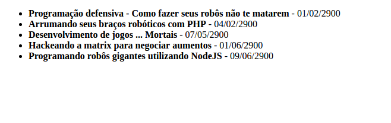
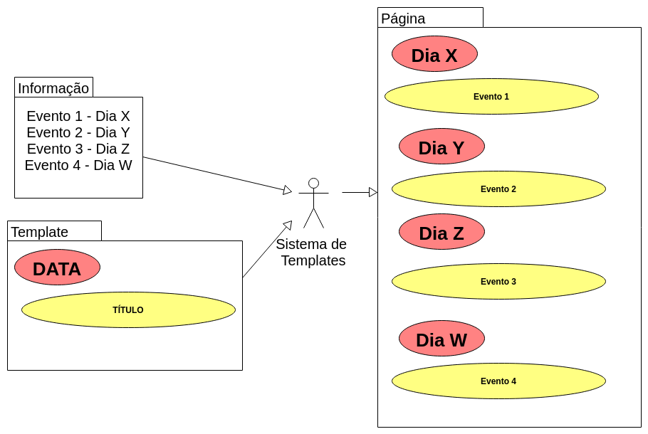
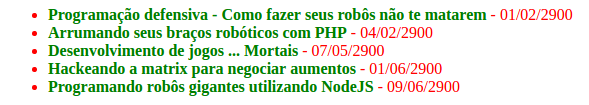

# Introduçao a processadores de HTML e CSS

Os navegadores modernos sabem ler **HTML**, **CSS** e **JavaScript**. Desenvolvedores modernos usam diversas outras ferramentas e linguagens para escrever esses códigos de maneira mais eficiente.
Nesta etapa do projeto vamos abordar o [Pug](https://github.com/pugjs/pug) para HTML e o [SASS](http://sass-lang.com/) para CSS.

Para usar essas ferramentas necessitamos da **linha de comando** na qual vamos usar o [Node](https://nodejs.org/en/) como forma de escrever programas em JavaScript e a ferramenta [NPM](https://www.npmjs.com/).

> Importante: Toda vez que você ver o símbolo :computer: é um link para como as coisas estão naquele momento.

## Instalando o Node (E o NPM vem junto)

O Node tem um instalador para todos os sistemas praticamente simplesmente navegue até [o site oficial](https://nodejs.org/en/) e baixe a versão mais atual.

## A linha de comando

A linha de comando é uma ferramenta para escrever texto(Comandos) que são transmitidos para programas que executam ações. A maioria dos usuários de computador estão acostumados com interfaces gráficas, no entando desenvolvedores muitas vezes usam e até preferem ferramentas de linha de comando.

Para abrir a linha de comando

**No windows**: Procure o programa terminal ou cmd

**No linux/Mac**: Procure o programa terminal

Uma vez que nós temos o node e npm instalados podemos começar a nos familiarizar. Para conferir se ambos estão instalados execute os seguintes comandos:
```shell
node --version
```

```shell
npm -v
```

Você deve obter um comportamento similar ao mostrado abaixo:

[](./cliExample.gif)

Parabéns você acabou de dar seus primeiros comandos em uma linha de comando!

### Pastas e navegação

Você quer que a suas aplicações fiquem contidas todas na mesma pasta. Para isso é importante saber navegar por pastas usando a linha de comando, para isso vamos listar alguns comandos iniciais:

- **cd NOME_DE_UMA_PASTA** - Navega até a pasta
- **dir** - Lista as pastas no diretório atual
- **cd ..** - Navega até a pasta anterior
- **mkdir** - Cria uma pasta

Para começarmos crie (pela linha de comando ou de forma tradicional), uma pasta chama projeto2 e navegue até ela como no exemplo abaixo.

[](./cliExample2.gif)

Isso muda o **diretório atual** é a referência de onde os comandos vão ser executados.

> Pense no diretório atual como a palavra **aqui**. A palavra não muda mas o significado do que é **aqui** é totalmente diferente se você está em casa ou no trabalho.

## Iniciando o nosso projeto

Agora que estamos com a linha de comando aberta na pasta desejada (A pasta projeto2 no caso), podemos iniciar o nosso projeto **node**.

Vamos executar um comando para iniciar o nosso projeto node. À fim de nos familiarizarmos mais com a linha de comando vamos usar uma abordagem interativa para isso.

Digite o comando

```shell
npm init
```

Isso significa "Programa npm execute o comando init", várias perguntas aparecerão e você vai poder responder todas uma por vez.

Caso queira usar a opção exibida aperte enter. Caso queira digitar algo digite, um exemplo desse processo encontra-se abaixo:

[](./npmInit.gif)

Ao final desse processo é gerado para nós um arquivo chamado **package.json** que possuí um formato similar à esse:

```json
{
  "name": "projeto_dois",
  "version": "0.0.1",
  "description": "Um projeto para o FCC-SP",
  "main": "index.js",
  "scripts": {
    "test": "echo \"Error: no test specified\" && exit 1"
  },
  "author": "fabio <fabiocostadev@gmail.com>",
  "license": "MIT"
}
```

Se você não gostar da aparência desse arquivo pode editar usando seu editor favorito ou rodar o comando npm init novamente.

> Até agora tudo o que fizemos foi:
> - Instalar um programa
> - Criar uma pasta
> - Navegar até essa pasta
> - Executar um comando que criou um arquivo

### Instalando dependências

Primeiramente **O que são dependências?** Dependências são códigos feitos por terceiros que nosso código precisa para funcionar. Basicamente nós usamos uma solução que alguém ou várias pessoas ao redor do mundo escreveram e usamos para desenvolver nossa própria solução.

É importante lembrar que todo programa têm um humano por trás dele e grande parte do software atual só funciona porque alguma pessoa resolveu compartilhar sua criação com o mundo. É a beleza do [código aberto](https://pt.wikipedia.org/wiki/C%C3%B3digo_aberto) ou [open source](https://en.wikipedia.org/wiki/Open-source_software).

A proposta desse projeto é aprender a usar alguma ferramenta de template(Pug) e algum processaodor de CSS(Sass) e também nos familizarizarmos com o desenvolvimento front end moderno com node e linha de comando.Sendo assim vamos começar instaland o pug.

Antes de começar instalando o mundo em nossos computadores só vamos entender como o **gerenciamento de dependências funciona no mundo node**.

- As dependências encontram-se me um local chamado **repositório**.
- Esse repositório é gerenciado pela **EMPRESA NPM** de forma livre, qualquer pessoa pode públicar suas criações no repositório.
- Podemos por exemplo pesquisar o **pacote** PUG [aqui](https://www.npmjs.com/package/pug). É porque os criadores do PUG publicaram esse pacote no repositório do NPM que podemos baixar ele.
- Utilizando a **FERRAMENTA NPM** podemos salvar o código dessa dependência no nosso projeto (aquele que tem o arquivo package.json na raíz).
- Essa dependência, e **TODAS DEPENDÊNCIAS DELA** e **TODAS DEPENDÊNCIAS DAS DEPENDÊNCIAS DELA** e assim por diante são convenientemente gerenciados por nós pela ferramenta NPM.

Vamos instalar nossa primeira dependência tudo que precisamos fazer é executar o comando (O --save é supérfluo em versões modernas do NPM mas por garantia vamos usá-lo):

```shell
npm install --save pug
```

Isso fará com que o programa pug seja salvo em uma pasta chamada node_modules e adicionar o arquivo numa parte de nosso papckage.json. De forma que na parte "dependencies" vai ter alguma versão do pug como no arquivo abaixo.

```json
{
  "name": "projeto_dois",
  "version": "0.0.1",
  "description": "Um projeto para o FCC-SP",
  "main": "index.js",
  "scripts": {
    "test": "echo \"Error: no test specified\" && exit 1"
  },
  "author": "fabio <fabiocostadev@gmail.com>",
  "license": "MIT",
  "dependencies": {
    "pug": "^2.0.0-rc.2"
  }
}
```

Você também vai notar a pasta node_modules salva com diversas outras pastas dentro. Estou mencionando isso simplesmente para te deixar ciente de onde a mágica acontece. As diversas outras pastas que não chamam PUG são dependências ou dependências das dependências.

[](./node_modules.png)


[:computer:](https://github.com/FreeCodeCampSp/projeto1_parte_2_codigos/tree/d12f6507a50869f0a93a02815ddcabfbd003ac5e)

### Iniciando nosso programa

Até o momento nós temos apenas um arquivo de configuração feito por uma ferramenta e um monte de código feito pro terceiros. É hora de começarmos a criar.

O Node é uma forma de **executar javascript em um computador e não só no navegador**, ou seja se você sabe javascript você pode programar em node. A **linguagem** é a mesma, apenas o **ambiente** é que muda.

Crie um arquivo chamado *index.js* usando seu editor favorito na mesma pasta (ou seja projeto2).
Para garantir que funcione digite o seguinte javascript:

```javascript
console.log('Olá mundo!')
```

E para garantir que funciona execute o comando
```shell
node index.js
```

Você deve ver a mensagem "Olá mundo!" no seu terminal.

[:computer:](https://github.com/FreeCodeCampSp/projeto1_parte_2_codigos/tree/9f458f734b48ef145cbca095f5bbf4bc23af68d7)

Vamos parar um segundo para apreciar e entender o que aconteceu:

> Utilizando a linha de comando (Não uma tela!);
> Nós mandamos um programa chamado **node**, ler um programa nosso chamado **index.js**.
> Esse programa **interpretou** nossos comandos e expôs na tela o resultado daquilo.

### De volta as raízes, HTML básico.

Para lembrar o porque estamos fazendo isso e entrando no contexto do projeto vamos fazer uma simples lista de eventos em HTML puro mesmo. Cada item da list atem um *nome* e uma *data* e para simplificar vamso criar eventos fictícios de um futuro distante. No seu editor de texto preferido crie um arquivo chamado index.HTML com o seguinte conteúdo

```html
  <!DOCTYPE html>
  <html>
    <head>
      <meta charset="utf-8">
      <title>Lista de eventos</title>
    </head>
    <body>
      <ul>
        <li><b>Programação defensiva - Como fazer seus robôs não te matarem</b> - 01/02/2900</li>
        <li><b>Arrumando seus braços robóticos com PHP</b> - 04/02/2900</li>
        <li><b>Desenvolvimento de jogos ... Mortais</b> - 07/05/2900</li>
        <li><b>Hackeando a matrix para negociar aumentos</b> - 01/06/2900</li>
        <li><b>Programando robôs gigantes utilizando NodeJS</b> - 09/06/2900</li>
      </ul>
    </body>
  </html>

```
[:computer:](https://github.com/FreeCodeCampSp/projeto1_parte_2_codigos/tree/7117668dd3c49d392d3876c87efb6ae3f160393b)

Você pode abrir esse arquivo no navegador e averiguar que ele deve parecer algo assim:

[](./exemploHTML.png)

É algo feio mas serve para nos mostrar o problema que queremos resolver. **A repetição**, toda vez que queremos um novo evento temos que escrever a mesma coisa (Um item da lista , um negrito com o título e a data). Se desejarmos mudar por exemplo a data para itálico ou adicionar alguma cor **precisamos fazer isso no mesmo número de eventos**.

É nesse conceito de evitar repetição que entra a idéia de templates. Pense nele como um molde, por exemplo de cerâmica. Se você mudar o molde pode repetir a mesma estrutura diversas vezes.

> O HTML é como esculpir uma estátua.
> Um sistema de template é como ter o molde da estátua ou imprimir em 3D, com a diferença que o resultado final é indistinguível do original.

Nosso objetivo é **Separar a informação da apresentação** ou seja, termos uma série de eventos e um layout e aplicar o mesmo para todos.

[](./diagramaTemplates.png)

### Eliminando a repetição com um sistema de templates

Agora o objetivo é eliminar a repetição de cada evento e transferir ele para um **componente** reutilizável. Vamos modificar nosso programa para pegar uma lista de eventos e publicar um HTML exatamente igual ao que já criamos utilizando o pug.

Primeiro vamos faze exatamente o mesmo código como pug e não como HTML. Salve o código abaixo em um arquivo chamado template.pug.

```pug
doctype html
html
  head
    meta(charset='utf-8')
    title Lista de eventos
  body
    ul
      li
        b Programação defensiva - Como fazer seus robôs não te matarem
        |  - 01/02/2900
      li
        b Arrumando seus braços robóticos com PHP
        |  - 04/02/2900
      li
        b Desenvolvimento de jogos ... Mortais
        |  - 07/05/2900
      li
        b Hackeando a matrix para negociar aumentos
        |  - 01/06/2900
      li
        b Programando robôs gigantes utilizando NodeJS
        |  - 09/06/2900
```

Perceba que a sintaxe é diferente, a repetição de elementos no final é eliminada os sinais também são omitidos. A ideia é diminuir a repetição também de código.

[:computer:](https://github.com/FreeCodeCampSp/projeto1_parte_2_codigos/tree/31afd01b212707aa56998a783376525a5f7d78f8)

Isso é nosso template, nós precisamos agora fazer com que esse arquivo se torne um arquivo .html que o navegador realmente entenda. Para isso vamos modificar aquele programa de hello world para pegar esse arquivo template.pug e criar um arquivo resultado.html.

O código completo dessa etapa encontra-se abaixo mas vamos comentar ele em detalhes passo a passo:

```javascript
// Pega o pacote para lidar com arquivos do node (fs = file system, sistema de arquivos)
var fs = require('fs')
// Pega o pacote instalado pug
var pug = require('pug')
//Retorna uma função que sabe transformar nosso template em HTML
var compileFunction = pug.compileFile('template.pug')
// Escreve em um arquivo chamado  resultado.html
fs.writeFileSync('resultado.html', compileFunction())
```

Na primeira parte nós usamos uma função do node chamada **require**.

```javascript
var fs = require('fs')
```

Isso significa basicamente o seguinte:
> Hey sistema de gerenciador de pacotes, ache algum pacote com esse nome, seja os instalados (por npm install) ou os que você já veio junto. Obrigado!

Então nós pedimos para ele pegar um pacote chamdo **fs** que é o que o node usa para lidar com arquivos.

Em seguida pedimos nosso recém instalado pug:

```javascript
var pug = require('pug')
```

Em seguida nós pedimos para ele pegar o template e nos retornar uma função que aplica esse template (Você pode pensar nela como aquele molde na analogia). Essa função pode pegar um template (no nosso caso algo estático ainda) e construir HTML com ele.

```javascript
var compileFunction = pug.compileFile('template.pug')
```

Em seguida nós pedimos para pegar o resultado do template (quando chamamso a compileFunction no final) e salvar em um arquivo com o nome de resultado.html

```javascript
fs.writeFileSync('resultado.html', compileFunction())
```

Ao invocar o programa como abaixo
```javascript
node index.js
```

Um arquivo resultado.html deve ser gerado (todo em uma linha só mesmo, o navegador não liga) assim com o abaixo

```html
<!DOCTYPE html><html><head><meta charset="utf-8"><title>Lista de eventos</title></head><body><ul><li><b>Programação defensiva - Como fazer seus robôs não te matarem</b> - 01/02/2900</li><li><b>Arrumando seus braços robóticos com PHP</b> - 04/02/2900</li><li><b>Desenvolvimento de jogos ... Mortais</b> - 07/05/2900</li><li><b>Hackeando a matrix para negociar aumentos</b> - 01/06/2900</li><li><b>Programando robôs gigantes utilizando NodeJS</b> - 09/06/2900</li></ul></body></html>
```

[:computer:](https://github.com/FreeCodeCampSp/projeto1_parte_2_codigos/tree/fc107c97d1c79be40305df58803b34f02fe0c619)

Por hora o Pug fornece uma forma de o arquivo não ser em uma única linha passando a opção {pretty: true}.

```javascript
// var compileFunction = pug.compileFile('template.pug')
// A linha acima vira
var compileFunction = pug.compileFile('template.pug', {pretty: true})
```

> NOTA: O pug vai remover essa função pretty no futuro. De qualquer forma só estamos o usando como objeto de estudo

[:computer:](https://github.com/FreeCodeCampSp/projeto1_parte_2_codigos/tree/76010a12a3f5d7d238e31c71076a04778b919d7b)

Até agora nós apenas chegamos no ponto de onde partimos. Vamos tentar diminuir nossa repetição de códigos conseguindo assim ser mais **escalável**, vamos separar os dados do conteúdo.

Primeiramente vamos escrever nossos dados em alguma variável para podermos reutilizá-lo

```javascript
var allEvents = [
  {
    name: 'Programação defensiva - Como fazer seus robôs não te matarem',
    date: '01/02/2900'
    },
  {
    name: 'Arrumando seus braços robóticos com PHP',
    date: '04/02/2900'
    },
  {
    name: 'Desenvolvimento de jogos ... Mortais',
    date: '07/05/2900'
    },
  {
    name: 'Hackeando a matrix para negociar aumentos',
    date: '01/06/2900'
    },
  {
    name: 'Programando robôs gigantes utilizando NodeJS',
    date: '09/06/2900'
    }
]
```

Como de costume seu arquivo deve parecer o do computadorzinho abaixo:

[:computer:](https://github.com/FreeCodeCampSp/projeto1_parte_2_codigos/tree/07a9f443ff8569c1509e604d1cec32b58870b5a0)

De nada adianta colocar essas informações se não usarmos ela nos templates, vamos modificar nosso template para usar essas variáveis:

Vamos atualizar nosso template.pug para o arquivo menor abaixo:

```pug
doctype html
html
  head
    meta(charset='utf-8')
    title Lista de eventos
  body
    ul
      each event in allEvents
        li
          b #{event.name}
          |  - #{event.date}
```

Perceba que não há nenhum dado fixo do evento, estamos apenas usando as informações da variável all events.

[:computer:](https://github.com/FreeCodeCampSp/projeto1_parte_2_codigos/tree/688b0677ddbc5af3d36e162dad9d9f3a3fb2b002)

### CSS - Adicionando um estilo

Assim como nós separamos os dados da marcação, separar o estilo também é algo que muitos desenvolvedores inciaintes já estão acostumados à fazer usando CSS.

Vamos adicionar algum estilo para nossos arquivos por exemplo modificanto a cor da tag bold. vamos salvar o código abaixo em um arquivo separado chamado index.css.

```css
b {
  color: green;
}
```

[:computer:](https://github.com/FreeCodeCampSp/projeto1_parte_2_codigos/tree/ea4c4d08194507202c55dbc2cffd3501c6382ae3)

E de nada adianta o arquivo se não o incluirmos no nosso template

```pug
doctype html
html
  head
    meta(charset='utf-8')
    title Lista de eventos
    link(rel='stylesheet', href='index.css')
  body
    ul
      each event in allEvents
        li
          b #{event.name}
          |  - #{event.date}
```

Agora nossos títulos devem ficar verdes como na imagem abaixo:

[](./exemploCss.png)

### CSS enxuto com sass

Assim como com o HTML que estamos escrevendo em Jade vamos começar a escrever a fonte do nosso CSS em sass, para isso assim como no PUG precisamos de algo que converta o SASS para CSS. No seu terminal digite o seguinte comando

```shell
npm install --save node-sass
```

Vamos renomear o arquivo index.scss para index.css (O dialeto do SASS que vamos usar é 100% compatível com CSS).

Agora vamos modificar esse conteúdo para algo que só seria aceito atualmente no sass, como por exemplo regras aninhadas, modifique o conteúdo para

```scss
ul {
  color: red;
  b {
    color: green;
  }
}

```

O conteúdo acima é equivalente ao CSS abaixo, e vamos fazer ele se tornar esse CSS em momentos:

```css
ul {
  color: red;
}
ul b {
  color: green;
}

```

Precisamos agora que nosso arquivo JS converta de SASS para CSS, no mesmo index.js vamos adicionar essa funcionalidade, modificando nosso JS para o JS abaixo:

```javascript
// Pega o pacote para lidar com arquivos do node (fs = file system, sistema de arquivos)
var fs = require('fs')
// Pega o pacote instalado pug
var pug = require('pug')
// Pega o pacote instalado node-sass
var sass = require('node-sass');

var allEvents = [
  {
    name: 'Programação defensiva - Como fazer seus robôs não te matarem',
    date: '01/02/2900'
    },
  {
    name: 'Arrumando seus braços robóticos com PHP',
    date: '04/02/2900'
    },
  {
    name: 'Desenvolvimento de jogos ... Mortais',
    date: '07/05/2900'
    },
  {
    name: 'Hackeando a matrix para negociar aumentos',
    date: '01/06/2900'
    },
  {
    name: 'Programando robôs gigantes utilizando NodeJS',
    date: '09/06/2900'
    }
]

//Retorna uma função que sabe transformar nosso template em HTML
var compileFunction = pug.compileFile('template.pug', {pretty: true})
// Escreve em um arquivo chamado  resultado.html
fs.writeFileSync('resultado.html', compileFunction({allEvents: allEvents}))
// Converte o SCSS para CSS
var cssResult = sass.renderSync({
  file: 'index.scss'
})
// Escreve em um artigo chamado index.css
fs.writeFileSync('index.css', cssResult.css)

```

[:computer:](https://github.com/FreeCodeCampSp/projeto1_parte_2_codigos/tree/15cf4c973b124dad3d687a757f8f8e7ff9ed5abf)

Atualmente a página resultado.html deve parecer conforme a página abaixo:

[](./exemploHTML2.png)
