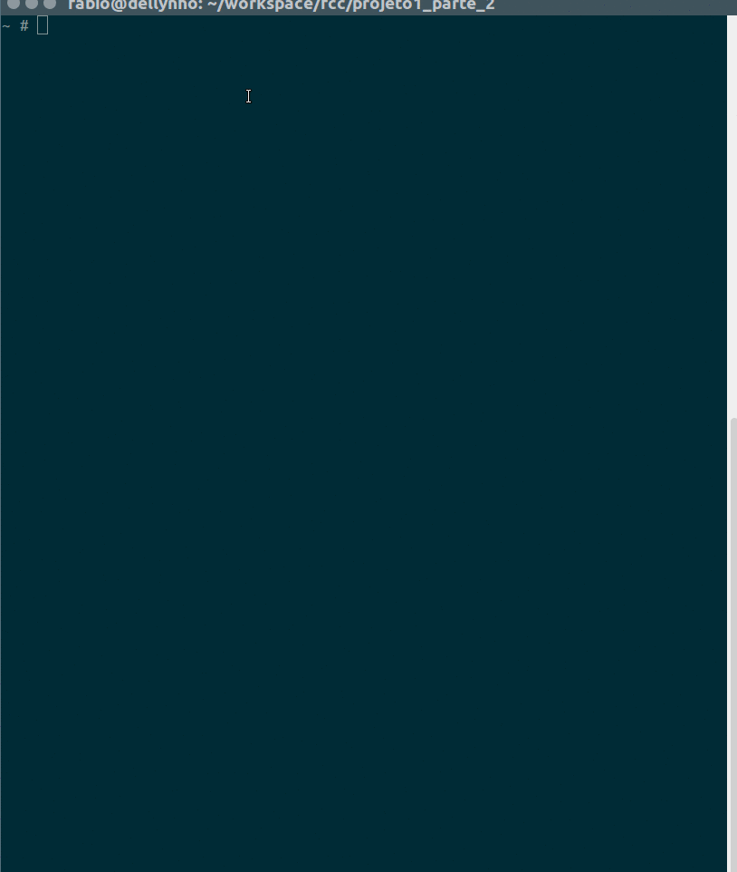

# Introduçao a processadores de HTML e CSS

Os navegadores modernos sabem ler **HTML**, **CSS** e **JavaScript**. Desenvolvedores modernos usam diversas outras ferramentas e linguagens para escrever esses códigos de maneira mais eficiente.
Nesta etapa do projeto vamos abordar o [Pug](https://github.com/pugjs/pug) para HTML e o [SASS](http://sass-lang.com/) para CSS.

Para usar essas ferramentas necessitamos da **linha de comando** na qual vamos usar o [Node](https://nodejs.org/en/) como forma de escrever programas em JavaScript e a ferramenta [NPM](https://www.npmjs.com/).

## Instalando o Node (E o NPM vem junto)

O Node tem um instalador para todos os sistemas praticamente simplesmente navegue até [o site oficial](https://nodejs.org/en/) e baixe a versão mais atual.

## A linha de comando

A linha de comando é uma ferramenta para escrever texto(Comandos) que são transmitidos para programas que executam ações. A maioria dos usuários de computador estão acostumados com interfaces gráficas, no entando desenvolvedores muitas vezes usam e até preferem ferramentas de linha de comando.

Para abrir a linha de comando

**No windows**: Procure o programa terminal ou cmd

**No linux/Mac**: Procure o programa terminal

Uma vez que nós temos o node e npm instalados podemos começar a nos familiarizar. Para conferir se ambos estão instalados execute os seguintes comandos:
```shell
node --version
```

```shell
npm -v
```

Você deve obter um comportamento similar ao mostrado abaixo:

[](./cliExample.gif)

Parabéns você acabou de dar seus primeiros comandos em uma linha de comando!

### Pastas e navegação

Você quer que a suas aplicações fiquem contidas todas na mesma pasta. Para isso é importante saber navegar por pastas usando a linha de comando, para isso vamos listar alguns comandos iniciais:

- **cd NOME_DE_UMA_PASTA** - Navega até a pasta
- **dir** - Lista as pastas no diretório atual
- **cd ..** - Navega até a pasta anterior
- **mkdir** - Cria uma pasta

Para começarmos crie (pela linha de comando ou de forma tradicional), uma pasta chama projeto2 e navegue até ela como no exemplo abaixo.

[](./cliExample2.gif)

Isso muda o **diretório atual** é a referência de onde os comandos vão ser executados.

> Pense no diretório atual como a palavra **aqui**. A palavra não muda mas o significado do que é **aqui** é totalmente diferente se você está em casa ou no trabalho.

## Iniciando o nosso projeto

Agora que estamos com a linha de comando aberta na pasta desejada (A pasta projeto2 no caso), podemos iniciar o nosso projeto **node**.

Vamos executar um comando para iniciar o nosso projeto node. À fim de nos familiarizarmos mais com a linha de comando vamos usar uma abordagem interativa para isso.

Digite o comando

```shell
npm init
```

Isso significa "Programa npm execute o comando init", várias perguntas aparecerão e você vai poder responder todas uma por vez.

Caso queira usar a opção exibida aperte enter. Caso queira digitar algo digite, um exemplo desse processo encontra-se abaixo:

[](./npmInit.gif)

Ao final desse processo é gerado para nós um arquivo chamado **package.json** que possuí um formato similar à esse:

```json
{
  "name": "projeto_dois",
  "version": "0.0.1",
  "description": "Um projeto para o FCC-SP",
  "main": "index.js",
  "scripts": {
    "test": "echo \"Error: no test specified\" && exit 1"
  },
  "author": "fabio <fabiocostadev@gmail.com>",
  "license": "MIT"
}
```

Se você não gostar da aparência desse arquivo pode editar usando seu editor favorito ou rodar o comando npm init novamente.

> Até agora tudo o que fizemos foi:
> - Instalar um programa
> - Criar uma pasta
> - Navegar até essa pasta
> - Executar um comando que criou um arquivo

### Instalando dependências

Primeiramente **O que são dependências?** Dependências são códigos feitos por terceiros que nosso código precisa para funcionar. Basicamente nós usamos uma solução que alguém ou várias pessoas ao redor do mundo escreveram e usamos para desenvolver nossa própria solução.

É importante lembrar que todo programa têm um humano por trás dele e grande parte do software atual só funciona porque alguma pessoa resolveu compartilhar sua criação com o mundo. É a belea do [código aberto](https://pt.wikipedia.org/wiki/C%C3%B3digo_aberto) ou [open source](https://en.wikipedia.org/wiki/Open-source_software).

A proposta desse projeto é aprender a usar alguma ferramenta de template(Pug) e algum processaodor de CSS(Sass) e também nos familizarizarmos com o desenvolvimento front end moderno com node e linha de comando.Sendo assim vamos começar instaland o pug.

Antes de começar instalando o mundo em nossos computadores só vamos entender como o **gerenciamento de dependências funciona no mundo node**.

- As dependências encontram-se me um local chamado **repositório**.
- Esse repositório é gerenciado pela **EMPRESA NPM** de forma livre, qualquer pessoa pode públicar suas criações no repositório.
- Podemos por exemplo pesquisar o **pacote** PUG [aqui](https://www.npmjs.com/package/pug). É porque os criadores do PUG publicaram esse pacote no repositório do NPM que podemos baixar ele.
- Utilizando a **FERRAMENTA NPM** podemos salvar o código dessa dependência no nosso projeto (aquele que tem o arquivo package.json na raíz).
- Essa dependência, e **TODAS DEPENDÊNCIAS DELA** e **TODAS DEPENDÊNCIAS DAS DEPENDÊNCIAS DELA** e assim por diante são convenientemente gerenciados por nós pela ferramenta NPM.

Vamos instalar nossa primeira dependência tudo que precisamos fazer é executar o comando (O --save é supérfluo em versões modernas do NPM mas por garantia vamos usá-lo):

```shell
npm install --save pug
```

Isso fará com que o programa pug seja salvo em uma pasta chamada node_modules e adicionar o arquivo numa parte de nosso papckage.json. De forma que na parte "dependencies" vai ter alguma versão do pug como no arquivo abaixo.

```json
{
  "name": "projeto_dois",
  "version": "0.0.1",
  "description": "Um projeto para o FCC-SP",
  "main": "index.js",
  "scripts": {
    "test": "echo \"Error: no test specified\" && exit 1"
  },
  "author": "fabio <fabiocostadev@gmail.com>",
  "license": "MIT",
  "dependencies": {
    "pug": "^2.0.0-rc.2"
  }
}
```

Você também vai notar a pasta node_modules salva com diversas outras pastas dentro. Estou mencionando isso simplesmente para te deixar ciente de onde a mágica acontece. As diversas outras pastas que não chamam PUG são dependências ou dependências das dependências.

[](./node_modules.png)

### Iniciando nosso programa

Até o momento nós temos apenas um arquivo de configuração feito por uma ferramenta e um monete de código feito pro terceiros. É hora de começarmos a criar.

O Node é uma forma de **executar javascript em um computador e não só no navegador**, ou seja se você sabe javascript você pode programar em node. A **linguagem** é a mesma, apenas o **ambiente** é que muda.

Crie um arquivo chamado *index.js* usando seu editor favorito na mesma pasta (ou seja projeto2).
Para garantir que funcione digite o seguinte javascript:

```javascript
console.log('Olá mundo!')
```

E para garantir que funciona execute o comando
```shell
node index.js
```

Você deve ver a mensagem "Olá mundo!" no seu terminal.
